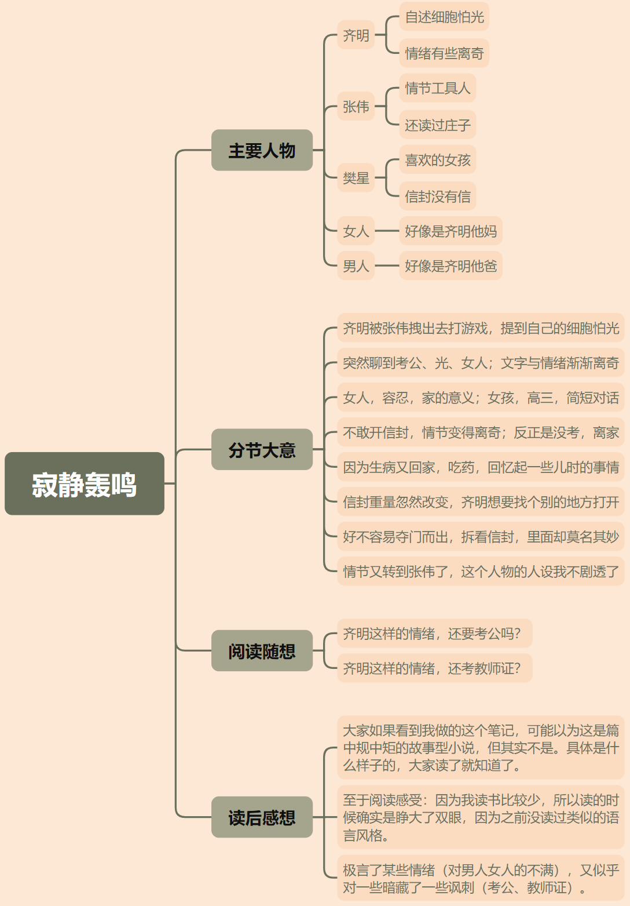

# 1701《寂静轰鸣》8114字

评论者 | 评论 |
|---|---|
作者自述|寂静轰鸣，一次尝试，细微的现象下藏着无尽轰鸣的心声，呈现一个极度敏感脆弱的个体，现代人或者麻木或者易燃易爆炸，仿佛莫名其妙被瞬间点燃，他们处于一种寂静轰鸣的状态，匍匐是脆弱的，飘渺的，不可捉摸的，起飞同样是脆弱的，飘渺的，不可捉摸的。十分感谢张大麻老师的鼓励和MPO老师的批评，一阳一阴，阴阳互补。
张大麻|既疏离，又浪漫。一开始的呕吐，怕黑，出租屋，游戏，网吧，家庭的冷漠，儿童时期看到的性，流产的胎儿，够丧够冷够灰暗。但如果只写这些，小说就无聊了。于是一封信出现了，里面是空的，还是被掉包，其实已经不重要，而且这个延拓的效果很好。那个叫樊星的女孩已经给出答案。她的话抚慰了躁动的野草，星空给她的信简直浪漫无边。小说在这里开始飞翔。要说缺点，就是语言有点细碎，还需要打磨一下。
mmmpo|我对这种情绪驱动的小说其实有一些自己比较私人的看法，能不能真的写一些挣脱地球引力的内容呢？ 既然在书写某种狂乱的状态，那能不能触碰一些相对少有人涉及的，或者说比较深入的，回旋的、系统的结构呢？比如说，可以写成接近于西哲语言系统的哲学怪谈（我自己爱这么耍，两个人互相进行生活柔化的哲学宣讲）或者是某种灵异超脱的恢宏感知。 作者的小说里，情绪的苦痛的种种逻辑，大多数要被归类入不能通过简单的肢体动作表达的范畴呀（开头的愤怒和亢奋，不应该是一种情爱相关的描写，作者把后文遮住，想一想，其他人读完第一自然段，想到的会是啥？）莫不如挑一些标志性，有余味有趣味的情节去支撑文本，多好啊。 我的感受哈，我觉得作者的情绪中，“不被理解”的底层情绪，可能还要大于恼怒的表征，作者或许可以思考一下用“不被理解”作为水面下的冰山，重新规划文本。而不是，在动作和具体行为上过度用力，很多地方用力大到如同歪嘴龙王出征了……我觉得人物不应该变成一个只会发怒（愤怒也好，我挺喜欢愤怒，发怒就不对了）的机器……就是说，能不能让故事真的飞起来，真的超脱起来，再植入这些愤怒的情绪体验。用力，可以用力在个体经历的事件上，个人感觉哈。
倾歌|读完了，开头还挺喜欢的，贯穿全文的光也很有意思。提个意见，不知道是不是因为故事的进行是受情绪驱动，所以想要以角色夸张的心理和动作表现出来？略微有点过犹不及了。举个例子，比如有地方写：抚摸信封，几乎全身颤抖呼吸加快， 还有信封是空的后，表现是抱住头颅拼命的挤。这些都让我觉得有点用力过度。
羊毛狐狸|该篇作品，仿佛是作者满满的一肚子话想要说，写在纸上，什么都没有。  里面充满着浮夸的粉饰性词句，如果有人说这都是什么意识流或者象征艺术或者什么文学蒙太奇什么的，那我宁可相信文学在这篇作品里就是一潭好看的死水。  我可能话有点重了，我觉得作者如果没有什么人生底蕴去表达什么东西，就不要用花里胡哨的词语去粉饰空洞的内容和粗浅的见解。没必要为了那点点细枝末节的小情绪写个8000多字的作品。 讲好一个故事，或者索性几句话几百字，可能还会变得有韵味。现在看完后，就感觉吵吵。
田伯光|能够把浓烈的情绪传达出来，对于作者来说，已然算得上某种完满。诸多细节上的瑕疵，都可以后期修正，可贵的，是表达。 在我看来，一种现代性的痛苦被展示得很到位，很难言说的，躁郁的，脆弱的，绝望的，愤怒的，悲伤的，令人精神内耗的，原生家庭成员之间里令人窒息的关系。加上文中反复出现的公考，强烈地感受到家庭伙同社会，聚合成挤压呼吸系统的力量。 一种情绪，并不会因为被无数人写过无数次就变得矫情和微不足道，每一次忠于内心的表达，只要找到一个共情的读者，就是人间值得。 主角无望黑暗生活里的唯二支点，在这溺水世界里的情感羁绊和救命稻草，一个是幻想出来的好朋友张伟，一个是和心仪女孩的暧昧温暖的情感往事。故事就是这样落到了那封信（情书）上。 如果非要吐槽一下，结尾是我抗议的，不知何所以就突然强行正面了，突然找到了存活的意义。前面情绪喷薄没觉得俗气，结尾处反而有了这种感觉。
秀秀|
我|看完了这个“毫不相干”的树状图，我跑去补看了这个《寂静轰鸣》，想补个评论：很多重要的地方我相信大师们都已经评点干净了。小弟我想从鸡蛋里挑根骨头。提下个人称和视角的问题。我个人建议把第三人称/上帝视角改成第一人称视角。文章里类似于躁郁症+精神分裂+厌食症+人格障碍等等的具体极端情绪描写都是第一人称所具备的感受；放在第三人称视角去描写会出戏。毕竟，作者进行情绪幻想描写的视角也是从主角的第一人称视角出发。另一种可能，如果这些情绪只是普通人为了表现情绪轰鸣而轰鸣的话，会给人一种缺乏铺垫略显做作的阅读感受。最后，如果是真的在描写病人，关于主角具体的发病症状还可以多翻阅相关心理书籍、病例分析报告来完善细节。