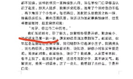
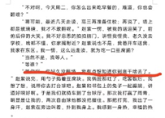

# 1711《打台球》10596字

评论者 | 评论 |
|---|---|
作者自述|打台球是我书写青春题材的一篇，年少之时，总会被不可得之物牵绊，更会被一些“可笑”的事物所迷茫。可时间不会停滞，台球一杆清，青春也就散场了
mmmpo|要模仿路内呀，又想要写东北絮叨风？ 但，之于路内，那种刺中灵魂的幽默感，得精细设计，段落处理需要一定程度的网文化，通俗化。主角团诡异的脑回路必不可少，主角团的口癖，灵性的看法，小说的叙述和语言节奏都要部分为情感让路。 之于东北风，我觉得有三点缺憾： 第一是没有啥情节的起伏，打架不是起伏，换句话说，没有一个轴心拉住故事，没有调整好叙述顺序和内容配比，等到小说的后半段，节奏已经乱了，哪怕在收尾，身为读者却感受不到共情，也没搞清楚故事在说啥。 第二是旁白介绍太多了，旁白介绍很断节奏的，而且大多非必要。 第三是对话不筋道，心理描写也不好，我觉得第二第三点的源头是对话，因为对话露怯，所以只能用旁白介绍去支撑摇摇欲坠的内容，心理描写也没滋没味。 最后总结两句，我觉得东北风是什么样的呢？语言虽然松散絮叨，但这只是表面，实际上要求具备强烈的“代入感”，要求剧情紧凑，有画面感，剧情一旦松懈，如语言一样絮叨，文本也便塌了，力道全无。 还有一点，很微妙，作者的文章情感不足，为啥情绪如此卡顿？ 我觉得，要么吊儿郎当，要么纠结痛苦，作者揪住一头去深挖，不能每种情绪都沾一点点，蜻蜓点水，这样等于什么都没写。 其次，话唠不要话唠在讲事上，话唠得话唠在情感上，这么说可能很抽象，比如作者说，我给你讲一个事，我点一段过往，作者总是想在讲事儿的时候埋感情，其实是错的，应该是讲感情的时候埋事儿， 我觉得上面那句话，特别特别特别重要（强调多少遍都不为过的重要）我的整篇评论，对作者最有用的可能就是这句话了。不要在讲事的时候“埋”情感。 而要在讲情感的时候“埋”事件。 这句话。埋这个词可能不太精准，换个词，渗透。   这一段，即使完全写同样的内容，我可能也要大刀阔斧的裁剪细节，调整说话的口气，找情绪的突破口。 小剧场的桥段设计， 情感宣泄的突破口（搭台子为的那么一下） 合适，入微的细节， 恰当的语言及行为， 我觉得以上四点，要多琢磨。 具体一点，这一自然段，没有妞的青春是不完整的， 这句话之后，后面应该接啥？ 我自己的语感，有这么几个路径： 继续吐槽别人或者自己身上的囧事，窘态。（这就是情感中渗透事件，往后的事件都为了情感主题服务的。） 抽象加工后的具体看法，我的痞气。 我和女朋友的相处的趣闻，这里一定要有小品化的情境构思，如果构思拉垮，那整个段落就完蛋了。 作者往后怎么写的呢？ 介绍一通别人有对象自己没有，自己胃酸酸地， 紧接着一个无趣的把女朋友养胖。 这两个部分的描写都很差。 那口气完全没提上来，首先要我的个性必须开始立体了，自卑又伤感，痞气，怎样都可以，但不能用一句胃酸酸地，停在这儿。 其次，得开始进攻了，与女朋友的相处，不能这么软塌塌，写细节却不写情绪，不如不写。 小说叙述出现的弥漫全文的问题，截图的那几个自然段，感觉比较集中的反映了。 这个小段落，表面上有路内的意思，但刨根问底，差许多东西，上面就是我想表达的，情感驱动故事，而不是故事里外渗一丢丢感情，不是摆个近似的行为的表皮便足够了。
MW|《打台球》，整体自然流畅，但我觉得情感线发展太快，这个题材或许可以写个小中篇。内容上，有不少巧思，语言印象最深的是我和赵紫的那段对话，我连说几句，赵紫连回几句，像微信对话一样，挺好，有趣。“直线与曲线之间，总是存在着隐蔽的缝隙。我找不到答案。”最后一句话从故事层回到叙事层，这种突破有利有弊，我在这看到的更多是利。
张大麻|台球：浑浑噩噩的青春故事，有一种疼痛感。一开始的停课有点莫名其妙，夏天，不是假期吗，后来又有申请复课，这个需要说明一下，为什么停课。到11页的地方，突然视角转换，许天变成王大烨，这种处理对于小说，好像也没有加分。语言流畅，人物中，赵紫的形象有点模糊，反而孙大飞挺立体。最后翻墙受伤应该是一个高潮，但那种疼痛感没有表达出来。
江雪|说起话来一跳一跳，怪怪的，走起路来一跳一跳好像还说的过去。 这个理由我个人觉得太牵强了 一个人为什么要去为另一个陌生人操心他翻不翻墙这种事，如果是熟人我还能理解，本来就不熟还为这种事情操心，况且这种事也并不是大事情，还是一个女生去关注一个男生这种事情。 我个人觉得大多数人不会因为这种事情就刻意去关注人家吧。 我的意思是她喜欢的这个理由很牵强，或者是说赵紫对男主的关注点牵强。 我觉得没有人会因为一个男孩子翻墙这种事情就会去关注，我个人觉得翻墙是很无聊的事情。 如果我是个女生，我想和这个男生见面绝对会找其他理由，而不是说找一个“因为你很久没翻墙，我比较好奇”的理由，故意在这个地方等你。