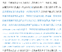
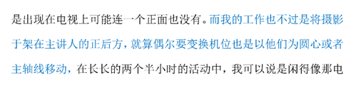
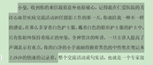
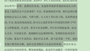

# 1719《往复书》19423字

评论者 | 评论 |
|---|---|
作者自述|这篇小说是匆匆赶稿的产物，写着写着发现怎么都不满意，一度想要全部删掉，不过实在是很想知道其他老师怎么看这样的作品，所以就投了稿。恶评是意料之中的事，一切批评意见我都欣然接受。不过我还是很感激居然有人可以看完它，愿意指出它所有的问题，并且寻找出那些微不足道的闪光点。
张大山|接到（你给我打的任何一个电话）或者（我给你打的任何一个电话），这也是病句，除非去掉后面那个“的”。所以我再也不能（发送）或者（接收）你的任何一条消息了，“发送你的任何一条消息”，同理。 前面全是“的”，我以为作者不屑于分“的得地”。到这儿竟然换了一个，结果是错的。 相信我，你这么拍，事后结不到钱的 又回到老生常谈的第二人称用法上来，本篇可以说是令人眼前一亮。因为也是用了“信”这个道具，解决了第二人称叙述中“跟我说话的是谁”的问题（万年不变的两个例子，《一个陌生女人的来信》《万卡》，当然从某种原教旨主义来看，写信不能算是纯正第二人称，因为不可避免掺入大量第一人称，跟本文关系不大，不多讨论。），但问题也在“信”的形式上。因为是为了实现第二人称叙述编造出来的叙述，所以文本作为一封信而言，就不像那么回事儿。一封信里面显然不会有如此多叙述和对话，而且设计成有来有回的三封信，就有点形式大于内容了，尤其是相比第二部分的篇幅，一、三部分体量过小，没有形成有效的结构。至于语言和内容，前面已经说过，有待修改。
羊毛狐狸|作者的语言需要练一下。注意慎重承接词，副词，尽量避免被动语态。尝试把长句变成短句。“越加的控制起来”，这句话怎么读怎么变扭。这样的句子好多。越加控制起来 不如直接改成：“老东西看得我更严了”，这样就比较顺口。老顾，告诉你一个不幸的消息。 我觉得，如果是两个亲密的人说话，平时应该不会这么说话。（图1） 我们要有一个基本的认知——关于词汇，最糟糕的做法之一是粉饰词汇 （以下都是斯蒂芬金原话） 记住，绝不用“酬劳”代替“小费”。 例子：约翰停留了完成一次排泄行为的时间。 改为：约翰停了拉泡屎的工夫。 当然，你也可以说：约翰停了个上大号的工夫 我不是教你说脏话，而是叫你有话直说。 准确描述很重要。你如果有所怀疑，想想你是不是经常听到这样的说法：“我实在无法形容这个”，或者：我不是这个意思。诸如此类。 总之，《往复书》这篇作品，语言是个关，作者要练。《往复书》的词汇和句式问题比较大。 其实，这篇文章，作者在写这种小细节的时候还挺有那啥的，看得出来，是思考过这个场景，或者尽自己最大努力去想象的。  大概我会这么改： 哎呀，我妆没化，快，张曼，你帮 我看看，能上镜吗？好看吗？ 不会，你底子好，素颜也美。 （是欣然接受的）——这句话没懂（图5）