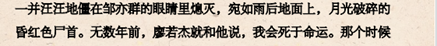
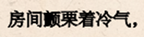
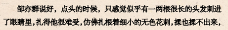
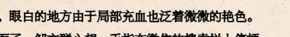

# 1735《如春》10512字

评论者 | 评论 |
|---|---|
作者自述|我其实很久没有正常写东西了，加上写的时候没有构思，直接想到什么写什么，一口气搞定，所以现在看来问题很多。 在这一篇里，主题“情书”我刻意写的很隐晦，着墨不多。写的虽然是同性恋的故事，但全文并没有明确点名，只出现了侧面的暗示，所以，如果想理解成挚友也没有关系。最开始这篇故事是以脑袋里一个突然出现的镜头开始，所以我也就让这个故事整体以电影蒙太奇镜头的方式呈现，一块块分割的片段组成了整体。但这种构成形式有个问题是，使文本有些离散，故事情节偏弱。本文中关于过去、现在、未来三个时间段的不停交错也是刻意为之，希望不会显得过分花哨Orz。 说回故事本身，关于两个主角，廖若杰和邹亦群之间的情感。我其实刻意把同性恋的倾向表达的比较隐晦和暧昧，廖若杰被撕毁的信，其实是给邹亦群的情书，正是因为被发现同性恋倾向，才会被迫转学，这也是角色被母亲厌弃和最后被精神失常的母亲所杀的死因。因为叛逆了传统的伦常，所以最后以命还母。 而另一个主角，其实也是带有一点点若有若无的倾向。廖若杰对邹亦群心怀暗恋，但邹亦群或许也在混淆的情感里喜欢过廖若杰。一个暧昧的称呼：杰。可以理解是友情，也可以理解为某些更难说的情感。 我其实一开始很纠结要不要点明，但是后来想了想，觉得还是不要了吧，同性恋也好，异性恋也好，我隐去那些比较吸引眼球的东西，是想写出来最根本的“情”，淡化标签，但并不确定这种处理的效果如何。 另外关于廖若杰再一次消失那里有提及出逃这个词语。其实已经在暗示真正意义上的最后一次出逃，逃离传统的伦常，即故事最后廖若杰的死亡。
读书家愚公|如春里面的修辞手法有点奇怪。   月光破碎的昏红色尸首。 月光，一般的经验都是黄色，虽然有血红色的所谓血月的，但是属于少见情况。因此这类看似要求新的譬喻，会带来一点非常怪异的不适。  像一些形容词的动词用法，对词语有语感上的一些要求，相对来说意义相对单一简洁的词汇，更适合以通感的形式做使动用法等创新使用。这个颤栗我个人认为不合适这么使用。   在比喻中，往往会强调本体和喻体之间的对应的部分，而如果强调了并不对应或冲撞的特色，会导致这个比喻的说服力缺失，比喻就不再生动。这个比喻里面首先是很长的头发，随后又变成了细小的花刺，长和细小之间的不匀称，会形成一种不和谐的存在。   实际上，我觉得句子写出精准的普通感，就挺好了，不必刻意求新，最后反而丧失准确度。比如这个艳色，本身就有别的指向意义，放在这里反而模糊了原意。 读完4号了，读的过程中我在思考一个问题，就是文中的句子，各种回环渲染表现出来的浓郁的感情，是否有必要？当我在那些句子中看到的，感觉可能是比较悲惨的歇斯底里的痛。但是这种痛，与我个人是隔着一层的，它并没有把我抓进这个故事里让我感同身受。究其原因，或者得出的写作上的反思，就是我觉得还是需要克制，控制住一种不必要的滥情。（这个我在前面的创作中也有很大的这类的问题），当然，最核心的问题还是在于，我们没有获得一个对这一类事件的更超脱的视角，这种视角以其更长的时间和更宽广的空间，使得对事件的观察和反思更充分深入。所以，这篇文字体现出来的不仅仅是语言结构等方面的问题，更重要也是要求我们更多磨砺自己的一种看待事件的本质并从本质去编排自己的文字。
张大麻|如春：是想表现两个人兄弟般的友谊，还是有其他暧昧的因素？反正我觉得有点暧昧，尤其是那声称呼：杰。如果没有暧昧，那么对于婚姻的感慨就有点莫名其妙。小说的语言有些问题，有些比喻真的不好，比如：昆虫分娩般，等等。还有，婚礼后那段视角转换也很突兀，男二的死也勉强。
Ta|文字很好，情感很细腻。写的是男孩子之间的事，但文字却像是出自女孩子的手笔。言语之中似乎透露出二人之间有不寻常的情谊。情节上，(例如说父母离异、母亲发疯、母杀子等)像是为人物特别设计。
冀翼|好像少年的友谊容易混淆友情和一点点爱情，这种微妙暧昧的状态一般会在发育期摆脱，爱情的归爱情，友情的归友情，而文中的人物可能没有能够建立起这种认知，可能这就是同性恋的根源吧。虽然故事没有明说，但同性的意味还是挺浓的，最后母亲亲手了结了自己的孩子，表达的是传统观念对人的束缚和吞噬。文字不疾不徐，娓娓道来，读起来比较舒服，最剧烈的情节如果写的更“克制”一点可能会更好。
清炒苦瓜|写了一段微妙的同性往事，邹亦群如果喜欢老婆又喜欢兄弟，差不多就是双性恋。朦朦胧胧的感情还行，但是母亲杀儿子很割裂，欠缺深刻探讨的内容，显得为了杀而杀，流入表面。虽然内容是同性或者双性的开拓，但是LGBL运动开展许久，这种探讨力度不够。
mmmpo|同性恋，是一个我们绝大部分人模糊知晓，但是无法真切体验的群体。 有点像通过超声波看世界的蝙蝠。知道，却无法理解。 因此，文中频繁出现的，某某人觉得，某某人发现，某某人如何想，以及上帝视角的总结陈词，都不合适。 打个比方，人类该怎么对同类阐述蝙蝠的超声波，总不至于把超声波作用原理介绍一遍吧？ 还是说，写蝙蝠觉得世界是黑暗的，它的口腔中发出了声波，世界因此变得光明？ 写蝙蝠发现，世界变成一团粘稠的黑暗，它感到前所未有的窒息，鲜红的雨水从天空飘落，落到皮毛上……之类之类的。 可以是可以，但是俗，又俗又假。 举个作者的段落：从前一起赶作业、吃零食、玩各种无聊游戏的朋友，说好了要当一辈子兄弟的朋友，不辞而别的朋友，所有复杂的情感统统被释义在同一个集合里，一个名为廖若杰的区间。在这个区间，所有情绪都异常秾丽，爱得坦坦荡荡，恨得刻骨铭心。所有邹亦群未知也未参与的过去都凝缩在一个小小疑问里，既广泛又狭小。廖若杰回复了，他说，我很好。他问，你呢。邹亦群也说，我很好。 这一段，起码在我看来，没有丝毫的共情…… 那么，人类能写好的是什么啦？蝙蝠在黑暗中飞行的姿态。 再举几个例子， 一个男人照顾醉酒的男人，把他拖到床上，然后给他剃胡子，剪脚趾甲。 一个男孩把另一个男孩收到的情书都收走了，把情书分门归类，同时把他认为最有威胁最真挚的情书给屏蔽了。 一个男孩把项链给扯断了，另一个男孩哭着把项链的链齿钳合，祈求男孩重新带上他。 一个男孩在和另一个男孩打电话，明明没有说很暧昧的话，却对周围人产生本能的排斥，不想让其他人听见，同时，没话找话，刻意拖着。 一个男孩在乘坐摩托时，搂骑车男孩的腰，搂得很紧，紧接着整个身体往前贴。 一个男孩谈生儿育女，另一个男孩嫉妒。 一个男孩，再触摸另一个男孩时幻想，觉得自己得到了全世界，虚荣心得到充分满足。 …… 至于作者的婚礼场景，我觉得要全推翻了，写一个同志来参加婚礼，要侧面写，因为，读者不能理解，作者也不能理解，不要扮演专家来给读者描述蝙蝠的飞行原理了，要抓住飞行姿态， 我看他们互相牵手时眩晕， 我躲到远远的地方祝福， 我看到宴席里其他的眉清目秀的小伙子，心里升起别样的欲望。 高潮环节，要么进行恋爱宣告，要么克制收场，爱而不得，这里都可以募仿男女的恋情了，但需要加入同的差别。 
就这样吧|这篇写的凄美中带着悲凉。看第一遍的时候，总觉的两个人物反过来了，群是那个更细腻的，通过文中描述他眼里的世界是咕嘟咕嘟冒着五彩的泡泡的，温柔且美好。最后死的是杰。 关于主题：兄弟之情，隐约的爱情·····写的刚刚好，尺度处理的很到位 关于基调。我现在都不敢说，这不符合男人的口吻。。。因为我会问自己，男人应该是什么口吻。。我完了。。哈哈 不足之处：我不是很喜欢那两个名字，总觉得很别扭。。 整体读起来有点粘稠的质感，最后一段看的我有点晕乎。。。。
